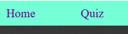
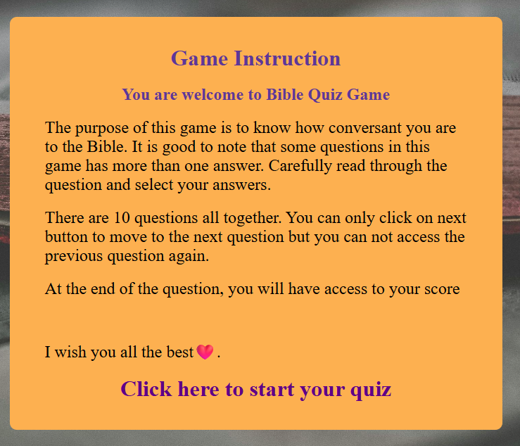
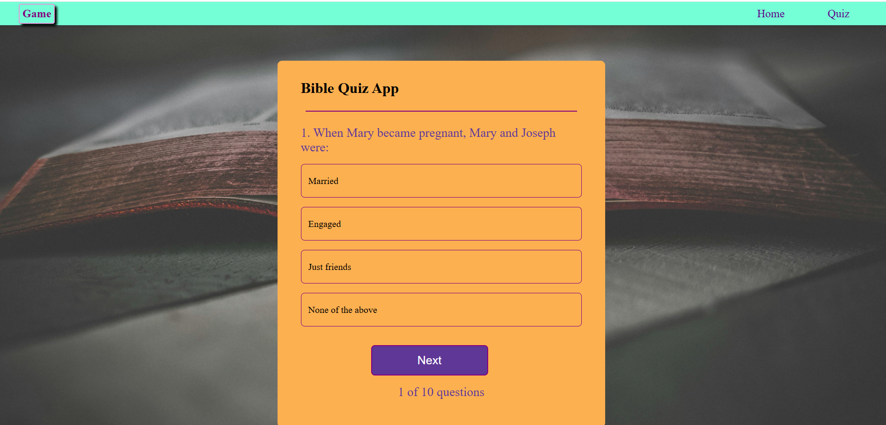
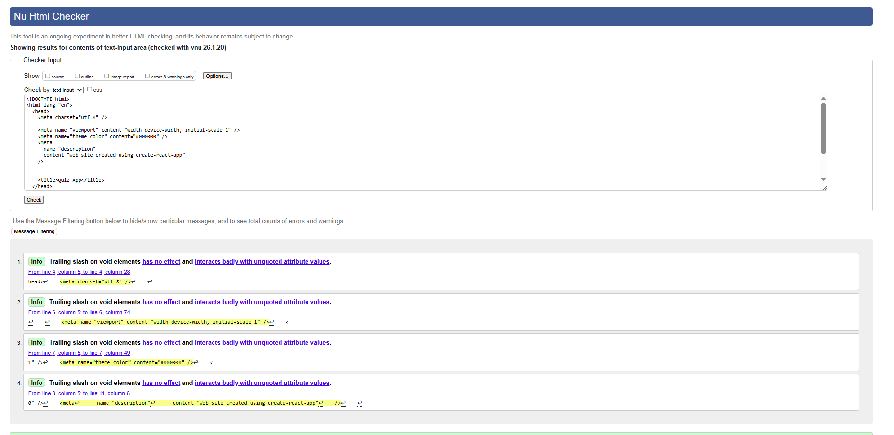

# Overview

Welcome to my online Bible Quiz App. This README file provides important information you need to be aware of as wel as how to get started.

## Introduction

This Bible quiz game reveals the essence of celebrating the birth of Jesus Christ at Christmas and also shows the depth of understanding of Scriptures about him.

## `Target Audience`

*Chritstians
*Bible readers
*Any who is curious to know about Jesus Christ
*Any who want to expores Bible

## `Features`
The website exists on only one page with multiple features available to the user

### Menu
At the top-right hand side of the page, there are 2 naviagation buttons (Home and Quiz) that allow the user to move around the game

### Home Page
The Home page contains game instruction on how the Bible quiz is structured and also has a link to start the quiz.

### Quiz Page
This page shows only one question per time with various types, Some Single Choice, multple choice and open-ended questions

### Score

Please note the scores are only visible to the user untill all the questions are answered. It is good to note that all questions are required or compusory to answer.

### `Technologies Used`

**HTML** was used as the foundation of the site.
**CSS** was used to add the styles and layout of the site.
**JavaScript** was used to create all the logic and visuals necessary to make the quiz work.
**VSCode** was used as the main code editor to write and edit code.
**Git** was used for the version control of the website.
**GitHub** was used to host the code of the website.

## `Testing`

In order to confirm the correct functionality, responsiveness and appearance:

The website was tested on Chrome and Edge web browsers, using in-built dev tools.

*Chrome

*The HTML file has passed HTML validity checks with W3C.

## Learn More

You can learn more in the [Create React App documentation](https://facebook.github.io/create-react-app/docs/getting-started).

To learn React, check out the [React documentation](https://reactjs.org/).

### Code Splitting

This section has moved here: [https://facebook.github.io/create-react-app/docs/code-splitting](https://facebook.github.io/create-react-app/docs/code-splitting)

### Analyzing the Bundle Size

This section has moved here: [https://facebook.github.io/create-react-app/docs/analyzing-the-bundle-size](https://facebook.github.io/create-react-app/docs/analyzing-the-bundle-size)

### Making a Progressive Web App

This section has moved here: [https://facebook.github.io/create-react-app/docs/making-a-progressive-web-app](https://facebook.github.io/create-react-app/docs/making-a-progressive-web-app)

### Advanced Configuration

This section has moved here: [https://facebook.github.io/create-react-app/docs/advanced-configuration](https://facebook.github.io/create-react-app/docs/advanced-configuration)

### Deployment

This section has moved here: [https://facebook.github.io/create-react-app/docs/deployment](https://facebook.github.io/create-react-app/docs/deployment)

### `npm run build` fails to minify

This section has moved here: [https://facebook.github.io/create-react-app/docs/troubleshooting#npm-run-build-fails-to-minify](https://facebook.github.io/create-react-app/docs/troubleshooting#npm-run-build-fails-to-minify)
